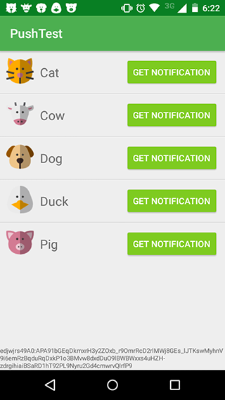
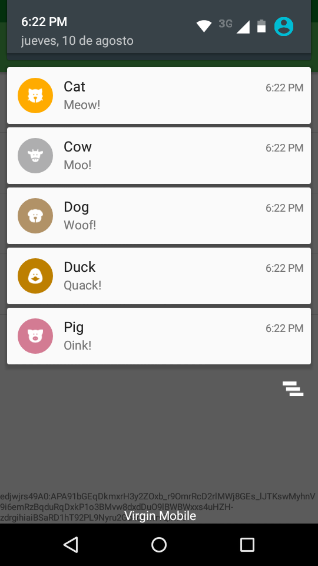
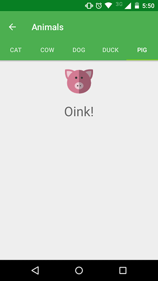

# Pushtest

A simple android app to test push notifications through FCM using a [Laravel app](https://github.com/bul-ikana/pushtest-laravel) as the backend. When a notification is received, it will open a tabbed activity and send it to the right fragment.

## Screenshots

## Before we begin

To run this project you need

* Android SDK
* Android Studio
* A Firebase account

## Running the project

* Clone the repo
* Create a Firebase project in the [Firebase console](https://console.firebase.google.com/)
* When prompted, enter `pushtest.mecabotware.com.pushtest` as the package name
* Download the `google-services.json` file, and put it in the `Pushtest/app/` directory
* Open the project in Android Studio
* Sync gradle
* Set your backend url in `Pushtest/app/src/main/res/values/config.xml`. This url must point to the `api/push` endpoint of the backend. Be sure to include the protocol (http/s) and leave no trailing slashes at the end. E.g. `http://localhost/api/push`
* Run app from Android Studio

## About

This app sends a request to a backend service to send a push notification to the device. The web server used can be found [here](https://github.com/bul-ikana/pushtest-laravel).

The app uses [OkHttp](https://github.com/square/okhttp) to manage http requests.

Icons made by [Freepik](http://www.freepik.com) from [Flaticon](https://www.flaticon.com/). Licensed by CC 3.0 BY

